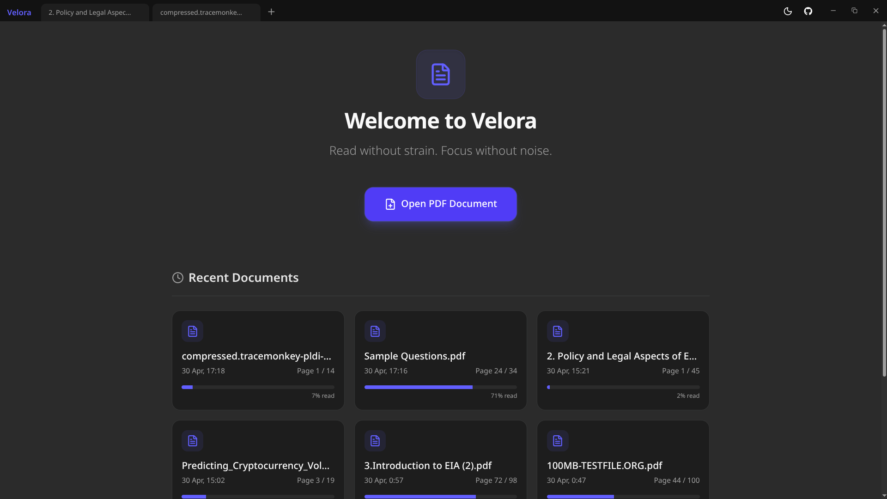
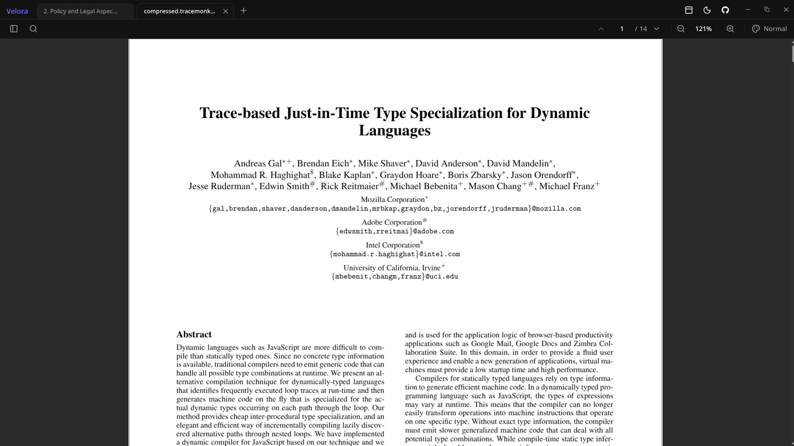
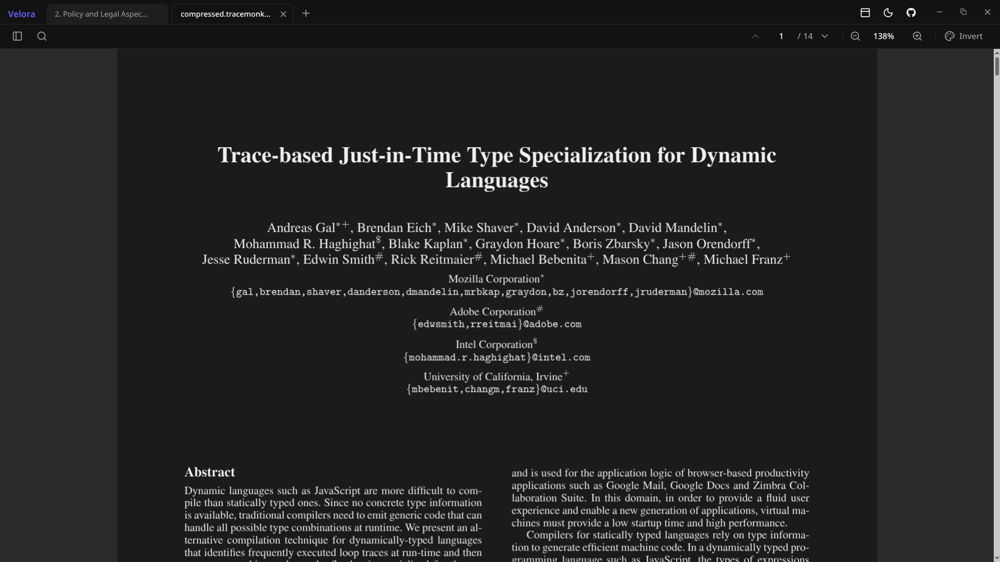
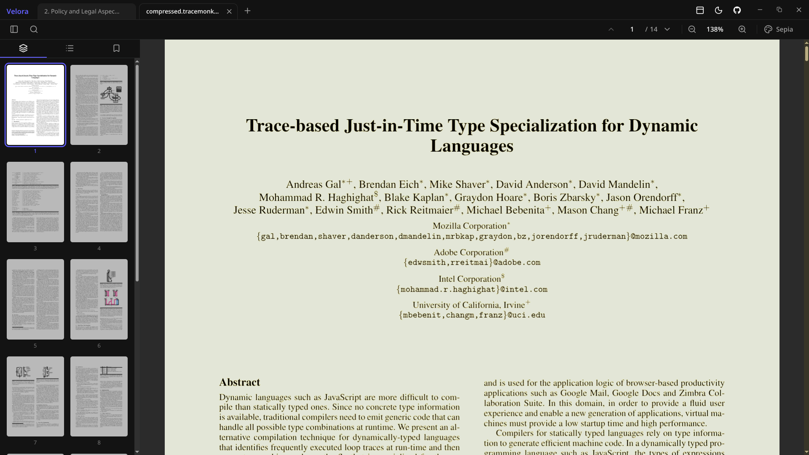

# Velora 📄


Velora is a modern, cross-platform PDF Reader and Document Viewer application built with Electron, React, and Vite. Designed for speed, responsiveness, and an exceptional user experience, Velora provides professional-grade tools for managing and reading PDFs directly on your desktop.

Dont forget to give a star ⭐, if found useful

#### Total downloads: 


## Download

👉 [Download Latest Release](https://github.com/manideepanasuri/Velora/releases/latest)

### Support the creator

<div style="text-align:center;width: 100%;"><div class="on-the-fly-behavior"><a href="https://getmechai.vercel.app/link.html?vpa=manideepanasuri@axl&nm=Manideep&amt=200" target="_blank"></a></div></div>

### Why I built it
Read it from [👉 here](https://medium.com/@manideepanasuri/i-built-a-dark-mode-pdf-reader-because-i-hated-every-existing-one-9734b8a45ac1)

### 📽️ Demo


https://github.com/user-attachments/assets/904de9c2-4343-4b2f-bce7-41642fc72385


### 📸 Screenshots

<div align="center">
  
  
</div>
<br>
<div align="center">
  
  
</div>

## ✨ Features

- **Built-in PDF Viewing:** Fast and responsive PDF rendering utilizing `pdfjs-dist`.
- **Cross-Platform:** Available and compilable on Windows, macOS, and Linux.
- **Draggable UI Elements:** Highly interactive user interfaces using `@dnd-kit`.
- **System-integrated Dark Mode:** Fully customizable theming automatically syncing with your OS.
- **Offline Storage:** Document management and indexing using IndexedDB (`idb`).
- **File Association:** Registers as a native viewer for `.pdf` files upon install.
- **Modern User Interface:** Built with Tailwind CSS and shadcn/ui for a premium, accessible experience.

## 🛠 Tech Stack

- **Framework:** Electron + React 19
- **Build Tool:** electron-vite
- **Language:** TypeScript
- **Styling:** Tailwind CSS 4, shadcn/ui, Radix UI
- **State Management:** Zustand
- **PDF Rendering:** pdf.js

## 🌙 Dark Mode Implementation

Dark mode in Velora is built gracefully using standard Web APIs, React Context, and Tailwind CSS configuration.

- **`ThemeProvider` Context:** The app utilizes a custom `ThemeProvider` that reads from `localStorage` to remember user preferences (`light`, `dark`, or `system`).
- **DOM Manipulation:** Depending on the set theme, it applies a `dark` class directly to the root HTML `window.document.documentElement`.
- **System Preference Detection:** If `system` is selected, the app utilizes `window.matchMedia("(prefers-color-scheme: dark)")` to detect and match the native OS theme.
- **Styling:** The UI is crafted with Tailwind CSS variables and the `dark:` variant, ensuring consistent styling changes seamlessly across all components without remounting.

## 🚀 Getting Started

### Prerequisites

- [Node.js](https://nodejs.org/) (v25.9.0 or higher recommended)
- `npm` package manager

### Installation

Clone the repository and install the dependencies:

```bash
git clone https://github.com/manideepanasuri/Velora.git
cd Velora
npm install
```

### Development

To start the application in development mode with Hot Module Replacement (HMR):

```bash
npm run dev
```

## 🏗️ Building for Production

Velora uses `electron-builder` under the hood. You can compile the project for specific platforms natively:

```bash
# Build for Windows
npm run build:win

# Build for macOS
npm run build:mac

# Build for Linux
npm run build:linux
```

*The installers and executables will be generated in the automatically created `dist/` or `out/` directory.*

## 📂 Project Structure

```text
velora/
├── src/
│   ├── main/          # Electron Main Process (System-level tasks)
│   ├── preload/       # Context Bridge between Main and Renderer
│   └── renderer/      # React Frontend (UI, Pages, PDF Canvas)
├── build/             # App icons and installer assets
├── electron-builder.yml # Release packaging configuration
└── electron.vite.config.ts # Vite configuration for all layers
```

## � Connect with Me

Developed by **Manideep Anasuri**. Feel free to reach out, check out my other projects, or read my latest articles!

- **GitHub:** [@manideepanasuri](https://github.com/manideepanasuri)
- **LinkedIn:** [https://www.linkedin.com/in/manideep-anasuri-](https://www.linkedin.com/in/manideep-anasuri-)
- **Blog:** [https://medium.com/@manideepanasuri/i-built-a-dark-mode-pdf-reader-because-i-hated-every-existing-one-9734b8a45ac1](https://medium.com/@manideepanasuri/i-built-a-dark-mode-pdf-reader-because-i-hated-every-existing-one-9734b8a45ac1)
